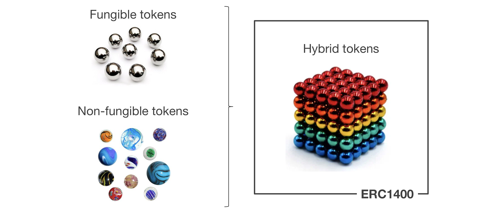
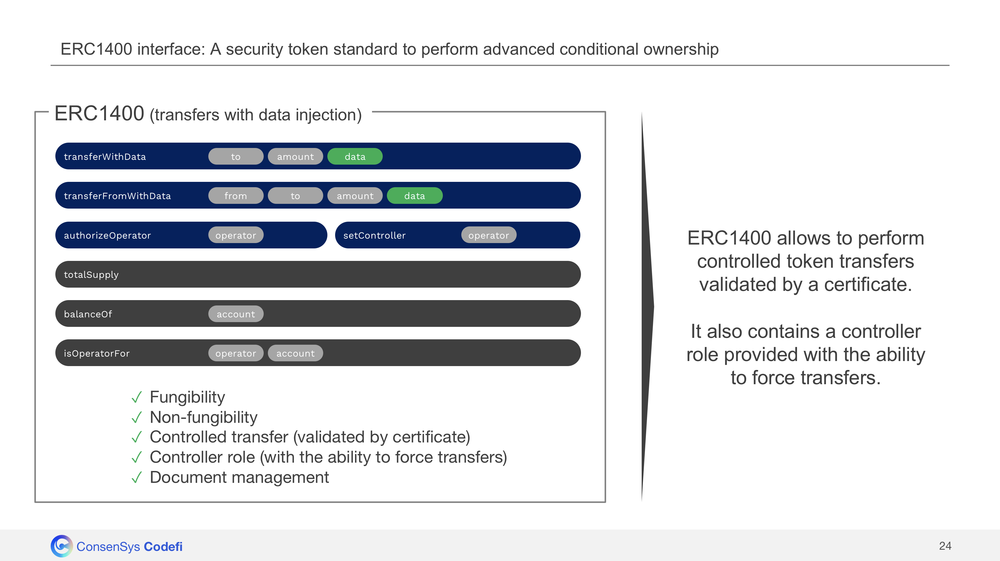
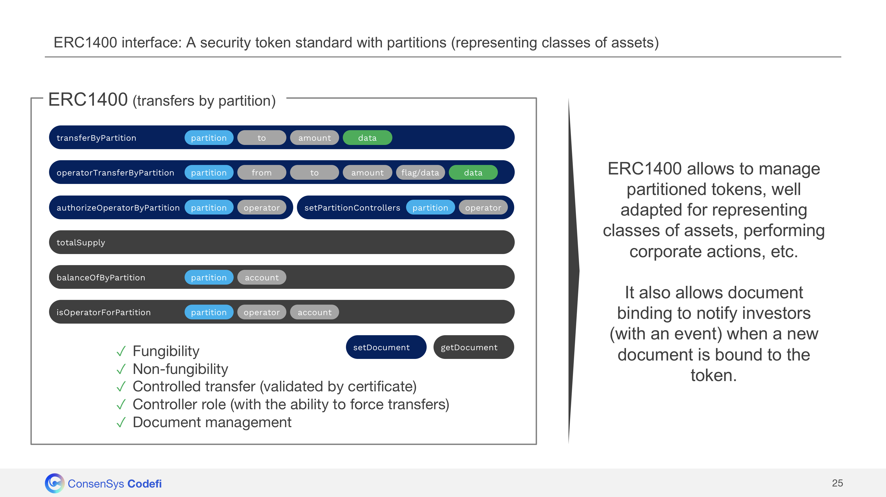

# Overview of the repo
 - [ERC1400 hybrid token standard](https://github.com/ConsenSys/ERC1400/blob/master/README.md)
 - [Certificate-based token transfers](contracts/certificate/README.md)
 - [Delivery-vs-payment](contracts/tools/DVP.md)
 - [Fund issuance](contracts/tools/FundIssuer.md)

# Introduction

Never heard of tokenization --> See introduction [here](https://medium.com/@consensyscodefi/how-to-explain-tokenization-to-six-year-olds-well-sort-of-consensys-codefi-a40780c5d4ca).

Blockchain technology and more specifically the emergence of "programmable" tokens have opened a world of new possibilities for financial assets: the creation of digital assets.
Digital assets are financial assets, which have been "tokenized". This means each asset is represented by a token on the blockchain.

As introduced by the [token taxonomy framework](https://github.com/token-taxonomy-consortium/TokenTaxonomyFramework), there are 3 main categories of tokens:
 - **Fungible tokens**: Fungible tokens are all identical and cannot be distinguished from each other. Each individual token is essentially interchangeable, like US dollars, company shares, or ounces of gold. This is probably the simplest and most common category of tokens.
 - **Non-fungible tokens**: A non-fungible token is unique. Non-fungible tokens (NFTs) are used to create verifiable digital scarcity, as well as representing asset ownership of things like real estate, luxury goods, works of art, or collectible objects in video games (CryptoKitties is an early example). Essentially, NFTs are used for items which require a unique digital fingerprint.
 - **Hybrid tokens**: Hybrid tokens are a mix of both. Each token belongs to a class (sometimes also called category/partition/tranche). Inside a given class, all tokens are the same: they are fungible. But tokens from different classes can be distinguished from each other: they are non-fungible. **By combining both advantages of fungibility and non-fungibility, hybrid tokens often appear as a relevant way to represent financial assets.**

 
 
Token standards have emerged in the Ethereum community.

**ERC20** is the most basic and most adopted token standard. It can be seen as the "axiom of fungible token standards" and is compatible with the majority of existing tools and platforms.

**ERC1400** is a hybrid token standard precisely designed for the use case of tokenized financial assets:
 - By being ERC20 retrocompatible, it remains compatible with the majority of existing tools and platforms.
 - By being partially-fungible (hybrid token), it allows to represent different classes of assets, perform more evolved token actions (lock tokens, collateralize tokens, etc.), which is essential in the context of corporate actions.
 - By offering the possibility to attach data to transfers, strong control over token transfers, based on granular certificate checks can be setup by issuers.

The following repository contains the ERC1400 implementation used by the Codefi Assets platform.


# What is Codefi Assets?

Codefi Assets is an advanced institutional technology platform for issuance and management of tokenized financial assets, powered by the Ethereum blockchain. Codefi Assets is a product created by ConsenSys.

https://codefi.consensys.net/codefiassets

### A platform for financial asset issuance & management

The current capital market still needs to overcome a few pain points:
 - Today, it is cumbersome and costly to issue an asset.
 - Once issued, the assets are mainly reserved for high-ticket investors.
 - Finally, those assets are not easily tradeable, which strongly limits the secondary market possibilities.

With Codefi Assets, we want to tokenize the capital market to tackle those pain points. In the new system, we imagine:
 - An asset issuance will be faster, simpler but also cheaper than today.
 - This reduction of costs will allow us to onboard smaller ticket investors.
 - Globally, the tokenization removes constraints for more liquid and frictionless asset transfers, while keeping a strong control over the market, thus liberating the secondary market.

### Video demo of an asset issuance platform based on Codefi Assets technology


Link to video:
https://www.youtube.com/watch?v=PjunjtIj02c


# Quick overview of token standards (ERC20, ERC1400) 





# Description of ERC1400 standard

ERC1400 introduces new concepts on top of ERC20 token standard:
 - **Granular transfer controls**: Possibility to perform granular controls on the transfers with a system of certificates (injected in the additional `data` field of the transfer method)
 - **Controllers**: Empowerment of controllers with the ability to send tokens on behalf of other addresses (e.g. force transfer).
 - **Partionned tokens** (partial-fungibility): Every ERC1400 token can be partitioned. The partition of a token, can be seen as the state of a token. It is well adapted for representing, classes of assets, performing corporate actions, etc.
 - **Document management**: Possibility to bind tokens to hashes of legal documents, thus making the link between a blockchain transaction and the real world.

Optionally, the following features can also be added:
 - **Hooks**: Possibility for token senders/recipients to setup hooks, e.g. automated actions executed everytime they send/receive tokens, thanks to [ERC1820](http://eips.ethereum.org/EIPS/eip-1820).
 - **Upgradeability**: Use of ERC1820([eips.ethereum.org/EIPS/eip-1820](http://eips.ethereum.org/EIPS/eip-1820)) as central contract registry to follow smart contract migrations.


# Focus on ERC1400 implementation choices

This implementation has been developed based on EIP-spec interface defined by the [security token roundtable](https://github.com/SecurityTokenStandard/EIP-Spec/blob/master/eip/eip-1400.md).

We've performed a few updates compared to the original submission, mainly to fit with business requirements + to save gas cost of contract deployment.

#### Choices made to fit with business requirements
 - Introduction of sender/recipient hooks ([IERC1400TokensRecipient](contracts/extensions/userExtensions/IERC1400TokensRecipient.sol), [IERC1400TokensSender](contracts/extensions/userExtensions/IERC1400TokensSender.sol)). Those are inspired by [ERC777 hooks]((https://eips.ethereum.org/EIPS/eip-777)), but they have been updated in order to support partitions, in order to become ERC1400-compliant.
 - Modification of view functions ('canTransferByPartition', 'canOperatorTransferByPartition') as consequence of our certificate design choice: the view functions need to have the exact same parameters as 'transferByPartition' and 'operatorTransferByPartition' in order to be in measure to confirm the certificate's validity.
 - Introduction of validator hook ([IERC1400TokensValidator](contracts/extensions/tokenExtensions/IERC1400TokensValidator.sol)), to manage updates of the transfer validation policy across time (certificate, whitelist, blacklist, lock-up periods, investor caps, pauseability, etc.), thanks an upgradeable module.
 - Extension of ERC20's allowance feature to support partitions, in order to become ERC1400-compliant. This is particularly important for secondary market and delivery-vs-payment.
 - Possibility to migrate contract, and register new address in ERC1820 central registry, for smart contract upgradeability.

#### Choices made to save gas cost of contract deployment
 - Removal of controller functions ('controllerTransfer' and 'controllerRedeem') and events ('ControllerTransfer' and 'ControllerRedemption') to save gas cost of contract deployment. Those controller functionalities have been included in 'operatorTransferByPartition' and 'operatorRedeemByPartition' functions instead.
 - Export of 'canTransferByPartition' and 'canOperatorTransferByPartition' in optional checker hook [IERC1400TokensChecker](contracts/extensions/tokenExtensions/IERC1400TokensChecker.sol) as those functions take a lot of place, although they are not essential, as the result they return can be deduced by calling other view functions of the contract.

NB: The original submission with discussion can be found at: [github.com/ethereum/EIPs/issues/1411](https://github.com/ethereum/EIPs/issues/1411).

# Interfaces

#### ERC1400 interface

The [IERC1400 interface](contracts/IERC1400.sol) of this implementation is the following:
```
interface IERC1400 /*is IERC20*/ { // Interfaces can currently not inherit interfaces, but IERC1400 shall include IERC20

  // ****************** Document Management *******************
  function getDocument(bytes32 name) external view returns (string memory, bytes32);
  function setDocument(bytes32 name, string calldata uri, bytes32 documentHash) external;

  // ******************* Token Information ********************
  function balanceOfByPartition(bytes32 partition, address tokenHolder) external view returns (uint256);
  function partitionsOf(address tokenHolder) external view returns (bytes32[] memory);

  // *********************** Transfers ************************
  function transferWithData(address to, uint256 value, bytes calldata data) external;
  function transferFromWithData(address from, address to, uint256 value, bytes calldata data) external;

  // *************** Partition Token Transfers ****************
  function transferByPartition(bytes32 partition, address to, uint256 value, bytes calldata data) external returns (bytes32);
  function operatorTransferByPartition(bytes32 partition, address from, address to, uint256 value, bytes calldata data, bytes calldata operatorData) external returns (bytes32);

  // ****************** Controller Operation ******************
  function isControllable() external view returns (bool);
  // function controllerTransfer(address from, address to, uint256 value, bytes calldata data, bytes calldata operatorData) external; // removed because same action can be achieved with "operatorTransferByPartition"
  // function controllerRedeem(address tokenHolder, uint256 value, bytes calldata data, bytes calldata operatorData) external; // removed because same action can be achieved with "operatorRedeemByPartition"

  // ****************** Operator Management *******************
  function authorizeOperator(address operator) external;
  function revokeOperator(address operator) external;
  function authorizeOperatorByPartition(bytes32 partition, address operator) external;
  function revokeOperatorByPartition(bytes32 partition, address operator) external;

  // ****************** Operator Information ******************
  function isOperator(address operator, address tokenHolder) external view returns (bool);
  function isOperatorForPartition(bytes32 partition, address operator, address tokenHolder) external view returns (bool);

  // ********************* Token Issuance *********************
  function isIssuable() external view returns (bool);
  function issue(address tokenHolder, uint256 value, bytes calldata data) external;
  function issueByPartition(bytes32 partition, address tokenHolder, uint256 value, bytes calldata data) external;

  // ******************** Token Redemption ********************
  function redeem(uint256 value, bytes calldata data) external;
  function redeemFrom(address tokenHolder, uint256 value, bytes calldata data) external;
  function redeemByPartition(bytes32 partition, uint256 value, bytes calldata data) external;
  function operatorRedeemByPartition(bytes32 partition, address tokenHolder, uint256 value, bytes calldata operatorData) external;

  // ******************* Transfer Validity ********************
  // We use different transfer validity functions because those described in the interface don't allow to verify the certificate's validity.
  // Indeed, verifying the ecrtificate's validity requires to keeps the function's arguments in the exact same order as the transfer function.
  //
  // function canTransfer(address to, uint256 value, bytes calldata data) external view returns (byte, bytes32);
  // function canTransferFrom(address from, address to, uint256 value, bytes calldata data) external view returns (byte, bytes32);
  // function canTransferByPartition(address from, address to, bytes32 partition, uint256 value, bytes calldata data) external view returns (byte, bytes32, bytes32);    

  // ******************* Controller Events ********************
  // We don't use this event as we don't use "controllerTransfer"
  //   event ControllerTransfer(
  //       address controller,
  //       address indexed from,
  //       address indexed to,
  //       uint256 value,
  //       bytes data,
  //       bytes operatorData
  //   );
  //
  // We don't use this event as we don't use "controllerRedeem"
  //   event ControllerRedemption(
  //       address controller,
  //       address indexed tokenHolder,
  //       uint256 value,
  //       bytes data,
  //       bytes operatorData
  //   );

  // ******************** Document Events *********************
  event Document(bytes32 indexed name, string uri, bytes32 documentHash);

  // ******************** Transfer Events *********************
  event TransferByPartition(
      bytes32 indexed fromPartition,
      address operator,
      address indexed from,
      address indexed to,
      uint256 value,
      bytes data,
      bytes operatorData
  );

  event ChangedPartition(
      bytes32 indexed fromPartition,
      bytes32 indexed toPartition,
      uint256 value
  );

  // ******************** Operator Events *********************
  event AuthorizedOperator(address indexed operator, address indexed tokenHolder);
  event RevokedOperator(address indexed operator, address indexed tokenHolder);
  event AuthorizedOperatorByPartition(bytes32 indexed partition, address indexed operator, address indexed tokenHolder);
  event RevokedOperatorByPartition(bytes32 indexed partition, address indexed operator, address indexed tokenHolder);

  // ************** Issuance / Redemption Events **************
  event Issued(address indexed operator, address indexed to, uint256 value, bytes data);
  event Redeemed(address indexed operator, address indexed from, uint256 value, bytes data);
  event IssuedByPartition(bytes32 indexed partition, address indexed operator, address indexed to, uint256 value, bytes data, bytes operatorData);
  event RedeemedByPartition(bytes32 indexed partition, address indexed operator, address indexed from, uint256 value, bytes operatorData);

}
```

#### ERC1066 interface for reason codes

To improve the token holder experience, canTransfer MUST return a reason byte code on success or failure based on the [ERC1066](https://ethereum-magicians.org/t/erc-1066-ethereum-status-codes-esc/283/24) application-specific status codes specified below. An implementation can also return arbitrary data as a bytes32 to provide additional information not captured by the reason code.
```
 * Code	Reason
 * 0x50	transfer failure
 * 0x51	transfer success
 * 0x52	insufficient balance
 * 0x53	insufficient allowance
 * 0x54	transfers halted (contract paused)
 * 0x55	funds locked (lockup period)
 * 0x56	invalid sender
 * 0x57	invalid receiver
 * 0x58	invalid operator (transfer agent)
 * 0x59	
 * 0x5a	
 * 0x5b	
 * 0x5a	
 * 0x5b	
 * 0x5c	
 * 0x5d	
 * 0x5e	
 * 0x5f	token meta or info
```


## Quick start: How to test the contract?

Prerequisites: please make sure you installed "yarn" on your environment.
```
$ brew install yarn
```

Make sure your node version is <=10.x.x. (yarn command fails for more recent node versions).

Test the smart contract, by running the following commands:
```
$ git clone git@github.com:ConsenSys/ERC1400.git
$ cd ERC1400
$ yarn
$ yarn coverage
```


## How to deploy the contract on a blokchain network?

#### Step1: Define Ethereum wallet and Ethereum network to use in ".env" file

A few environment variables need to be specified. Those can be added to a ".env" file: a template of it can be generated with the following command:
```
$ yarn env
```

The ".env" template contains the following variables:

MNEMONIC - Ethereum wallets which will be used by the webservice to sign the transactions - [**MANDATORY**] (see section "How to get a MNEMONIC?" in appendix)

INFURA_API_KEY - Key to access an Ethereum node via Infura service (for connection to mainnet or ropsten network) - [OPTIONAL - Only required if NETWORK = mainnet/ropsten] (see section "How to get an INFURA_API_KEY?" in appendix)

#### Step2: Deploy contract

**Deploy contract on ganache**

In case ganache is not installed:
```
$ yarn global add ganache-cli
```
Then launch ganache:
```
$ ganache-cli
```

In a different console, deploy the contract by running the migration script:
```
$ yarn truffle migrate
```

**Deploy contract on ropsten**

Deploy the contract by running the migration script:
```
$ yarn truffle migrate --network ropsten
```


### RECOMMENDATIONS FOR THIS FORK
How to run the tests
Run ganache:
```
ganache-cli --allow-Unlimited-Contract-Size
```

Run the unit tests with truffle (already globally downloaded)
```
yarn truffle test
```
To mix all the necessities of the Backward compatible ERC1400ERC20 (File to create bin/abi and validate source code in etherscan
```
yarn build:ERC1400
```
```
yarn build:ERC1400TokensValidator
```

Migrating on Locally
```
truffle migrate
```

Migrating on Kovan
```
truffle migrate --network kovan --reset
```

After running the Kovan script you can verify a contract with truffle verify if you wish (i.e. STERegistryV1 as such):

```
truffle run verify STERegistryV1 --network kovan
```

To get a compiled bytescode and ABI, you could use this method for the standard toekns
Copy the output of ERC1400ERC20 and/or ERC1400TokensValidator into Remix https://remix.ethereum.org
Compile it with the version and mostly default settings, *plus the optimization option enabled for large contracts*
From here you can use the solidity compiler tab to get an abi and bytecode you can copy into another project to interact
You can also test deploying the contract, or using the compiled contract to communicate to the contract using the Deploy & Run Transactions panel
*Important note* Remember the ERC1820 contract that is apart of migrations in the contract, is deployed on your chain before trying to deploy a ERC1400.

OR just migrate normally as above and run truffle verify and everything will be on etherscan

###Deployments (Kovan)
Run 
```yarn all```
To build each flattened contract in artifacts(To copy into remix)

Current Deployments Here-

Token Deployed
https://kovan.etherscan.io/token/0x835735075656cf20f143dce40b509edc1ca56831

**MultipleIssuanceModuleFactory**: 0x3aAEd08b227cdE3Faa5a405948b5bEB8E0d3a6a2

**VotingModuleFactory**: 0x99017d72BB3855eB553f202265a709889EfCC04B

**DividendsModuleFactory**: 0xDa1b3ca62D15f60643Be67CDd9a5669ef0212D17

**CheckpointsModuleFactory**: 0x7dc40053557F9D384eBEf8507CD047A0828155e1

**TokensCheckerFactory**: 0x51035aEac087a21b8845B24CE920e704e0f9B4f1

**TokensValidatorFactory**: 0x3085B449B3bFf63fB8eaF5d47db11759f37fC7C6

**ModulesDeployer**: 0x840C808EF3D3Ab9Cb4681F4C30f10f7579d64DE8

**STEFactory**: 0x678bE6b31311C0D36a12195fb5593b9594d8AfD5

**STERegistryV1**: 0x764D39E2497c25cfB52674A8621BC63524d32E79

Parameters to deploy the ModulesDeployer above included:

["0x455243313430304d756c7469706c6549737375616e6365000000000000000000","0x45524331343030546f6b656e7356616c696461746f7200000000000000000000","0x45524331343030546f6b656e73436865636b6572000000000000000000000000", "0x45524331343030546f6b656e73436865636b706f696e7473a000000000000000", "0x45524331343030546f6b656e73436865636b706f696e74732000000000000000", "0x45524331343030546f6b656e73566f74696e6700000000000000000000000000"]

["0x3aAEd08b227cdE3Faa5a405948b5bEB8E0d3a6a2","0x5Ea63c30B7D804E81E6c2A98b0BD2fc95346bA4d","0x3085B449B3bFf63fB8eaF5d47db11759f37fC7C6", "0x7dc40053557F9D384eBEf8507CD047A0828155e1","0xDa1b3ca62D15f60643Be67CDd9a5669ef0212D17", "0x99017d72BB3855eB553f202265a709889EfCC04B"]

How to connect to remix ide:

remixd -s /Users/user/Repos/ERC1400/artifacts --remix-ide https://remix.ethereum.org

## APPENDIX

### How to get a MNEMONIC?

#### 1.Find a MNEMONIC

There are 2 options to get MNEMONIC:
 - Either generate 12 random words on https://iancoleman.io/bip39/ (BIP39 Mnemonic).
 - Or get the MNEMONIC generated by ganache with the following command:
```
$ ganache-cli
```
The second option is recommended for development purposes since the wallets associated to the MNEMONIC will be pre-loaded with ETH for tests on ganache.

#### 2.Load the wallet associated to the MNEMONIC with ether

If you've used ganache to generate your MNEMONIC and you only want to perform tests on ganache, you have nothing to do. The accounts are already loaded with 100 ETH.

For all other networks than ganache, you have to send ether to the accounts associated to the MNEMONIC:
 - Discover the accounts associated to your MNEMONIC thanks to https://www.myetherwallet.com/#view-wallet-info > Mnemonic phrase.
 - Send ether to those accounts.

### How to get an INFURA_API_KEY?

INFURA_API_KEY can be generated by creating an account on https://infura.io/
